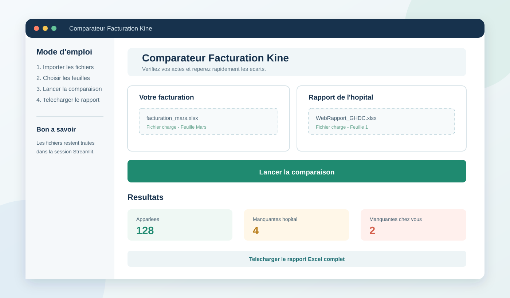

# Comparateur de facturation kiné

Comparez en quelques secondes votre facturation avec le rapport Excel de l’hôpital et repérez les actes manquants avant la clôture.



## À quoi sert l’application ?

Cette application Streamlit rapproche deux sources :

- votre fichier de facturation personnelle ;
- le WebRapport de l’hôpital au format Excel.

Elle normalise les noms, dossiers et codes de facturation, puis affiche immédiatement :

- les actes appariés ;
- les actes présents dans votre facturation mais absents du rapport de l’hôpital ;
- les actes présents dans le rapport mais absents de votre facturation.

Un rapport Excel complet peut ensuite être téléchargé pour archivage ou vérification.

## Fonctionnement

1. Importez votre fichier de facturation (`.xlsx` ou `.xls`).
2. Sélectionnez la feuille Excel correspondant au mois à contrôler.
3. Importez le WebRapport de l’hôpital au format Excel.
4. Sélectionnez sa feuille si le fichier en contient plusieurs.
5. Cliquez sur **Lancer la comparaison**.
6. Consultez les écarts et téléchargez le rapport détaillé.

Les fichiers Excel peuvent contenir les codes `M 24`, `M 6`, `K-1`, `RECOND`, `K3/4`, `K 20` et `K 15`.

## Installation locale

### Prérequis

- Python 3.9 ou version ultérieure
- pip

### Lancer l’application

```bash
git clone https://github.com/Antonin-m84/comparateur-facturation-kine.git
cd comparateur-facturation-kine
python -m venv .venv
source .venv/bin/activate
pip install -r requirements.txt
streamlit run streamlit_app.py
```

L’application sera disponible à l’adresse `http://localhost:8501`.

## En cas de problème avec un fichier Excel

Si le WebRapport est refusé ou ne peut pas être lu :

1. Ouvrez le fichier dans Excel.
2. Cliquez sur **Activer la modification**.
3. Enregistrez le fichier avec `Ctrl+S`.
4. Importez à nouveau le fichier dans l’application.

## Déploiement

Les consignes de déploiement et de redéploiement sont disponibles dans [DEPLOYMENT.md](DEPLOYMENT.md).

## Technologies

- [Streamlit](https://streamlit.io/) pour l’interface
- [pandas](https://pandas.pydata.org/) pour le traitement des données
- [openpyxl](https://openpyxl.readthedocs.io/) et `xlrd` pour la lecture des fichiers Excel

## Licence

Ce projet est distribué sous licence MIT. Voir [LICENSE](LICENSE).
